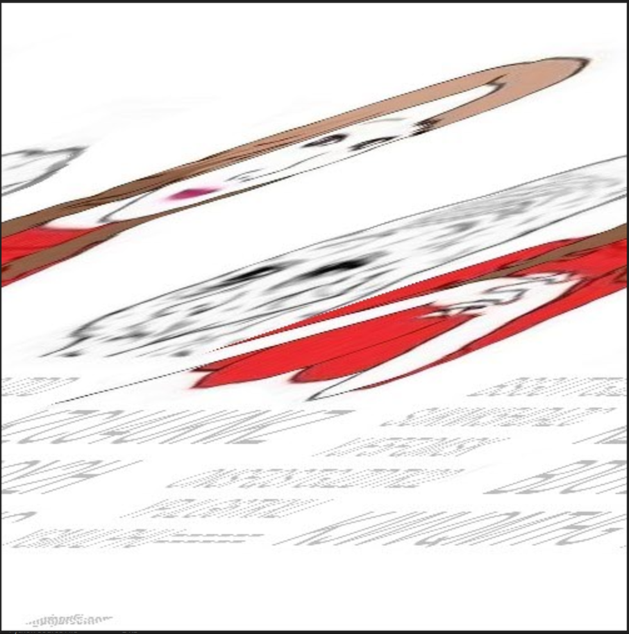

# brokenimg

Inspecting chall.pdf in a text editor reveals an interesting bit at the end:

```python
<?xpacket begin='' id='W5M0MpCehiHzreSzNTczkc9d'?>
<x:xmpmeta xmlns:x='adobe:ns:meta/' x:xmptk='Image::ExifTool 12.65'>
<rdf:RDF xmlns:rdf='http://www.w3.org/1999/02/22-rdf-syntax-ns#'>

 <rdf:Description rdf:about=''
  xmlns:tiff='http://ns.adobe.com/tiff/1.0/'>
  <tiff:Artist>Maybe here : 150 164 164 160 163 72 57 57 146 151 154 145 163 56 144 157 170 142 151 156 56 147 147 57 157 63 126 144 162 115 160 164 56 160 156 147</tiff:Artist>
 </rdf:Description>
</rdf:RDF>
</x:xmpmeta>
```

Converting the code from octal to ascii gives us a link to an image:

```python
Octal: 150 164 164 160 163 72 57 57 146 151 154 145 163 56 144 157 170 142 151 156 56 147 147 57 157 63 126 144 162 115 160 164 56 160 156 147
ASCII: https://files.doxbin.gg/o3VdrMpt.png
```

Here is a preview:



```python
❯ pngcheck -vv o3VdrMpt.png
File: o3VdrMpt.png (178662 bytes)
  chunk IHDR at offset 0x0000c, length 13
    500 x 502 image, 24-bit RGB, non-interlaced
  CRC error in chunk IHDR (computed 097ce9d6, expected 8fe89b78)
ERRORS DETECTED in o3VdrMpt.png
```

Checking the image with pngcheck reveals that the CRC checksum is invalid, indicating that the IHDR bytes have been tampered with. As the image seems visually skewed the most likely issue seems that the width bytes have been modified. Using [https://github.com/cjharris18/png-dimensions-bruteforcer](https://github.com/cjharris18/png-dimensions-bruteforcer) we can bruteforce width, height combinations until we find one that produces a matching CRC:

```python
❯ ./png_dimensions_bruteforce.py -f o3VdrMpt.png -o out.png -v
===================================================
    **    PNG Image Dimension Bruteforcer    **
               Created by cjharris18
===================================================

[+] Found Correct Dimensions...
Width: 500
Height: 501

Remember to pad this with leading 0's as required.

Successfully wrote to: out.png
```

Opening out.png we see that it is still corrupted:


At this point I wanted to modify the raw bytes responsible for the width of the image, but the result was kind of hard to read (I did find that the resolution should be 497x501 though):


Apparently this had something to do with invalid filters, although I’m not sure exactly what that means:

```python
❯ pngcheck -vv FINAL_497x500.png
File: FINAL_497x500.png (178662 bytes)
  chunk IHDR at offset 0x0000c, length 13
    497 x 500 image, 24-bit RGB, non-interlaced
  chunk IDAT at offset 0x00025, length 65536
    zlib: deflated, 32K window, default compression
    row filters (0 none, 1 sub, 2 up, 3 avg, 4 paeth):
      1 0 0 0 0 0 0 0 0 0 0 0 0 0 0 0 0 0 0 0 0 0 0 0 0
      0 0 0 0 0 0 0 0 0 0 0 0 0 0 0 0 0 0 0 0 0 0 0 0 0
      0 0 0 0 0 0 0 0 0 0 0 0 0 0 0 0 0 0 0 0 0 0 0 0 0
      0 0 0 0 0 0 0 0 0 0 0 0 0 0 0 0 0 0 0 0 0 0 0 0 0
      0 0 0 0 0 0 0 0 0 255 0 0 0 0 0 0 0 0 0 0 0 0 0 0 0
      0 0 0 0 0 0 0 0 0 0 0 0 0 0 0 0 0 0 0 0 0 0 0 0 0
      0 0 0 0 0 0 1 0 0 0 255 0 0 0 0 0 0 0 0 0 0 0 0 0 0
      0 0 0 0 0 0 0 0 0 0 0 0 0 0 0 0 0 0 0 1 0 0 0 0 1
      1 2 1 1 0 0 0 0 (208 out of 500)
  chunk IDAT at offset 0x10031, length 65536
    row filters (0 none, 1 sub, 2 up, 3 avg, 4 paeth):
      0 1 0 0 0 1 0 1 0 255 254 255 0 0 255 255 0 2 3 3 255 255 2 3    invalid row-filter type (5)
    invalid row-filter type (10)
    invalid row-filter type (76)
    invalid row-filter type (36)
 0
      242 234 180    invalid row-filter type (69)
    invalid row-filter type (72)
ERRORS DETECTED in FINAL_497x500.png
```

To replicate the result manually we can instead load all rgb values from the image into a 1-dimensional array, and then split the array every 497 pixels into a 2D image:

```python
from PIL import Image
import numpy as np

TARGET_WIDTH = 497
TARGET_HEIGHT = 501

original_image = Image.open("image.png").convert("RGB")
image_array = np.array(original_image)
flat_image_array = image_array.reshape(-1, 3)
total_pixels = flat_image_array.shape[0]
new_image_array = np.zeros((TARGET_HEIGHT, TARGET_WIDTH, 3), dtype=np.uint8)

for i in range(TARGET_HEIGHT):
    for j in range(TARGET_WIDTH):
        idx = i * TARGET_WIDTH + j
        if idx < total_pixels:
            new_image_array[i, j] = flat_image_array[idx]

reshaped_image = Image.fromarray(new_image_array, "RGB")
reshaped_image.save("reshaped.png")
```


We can now see two encoded strings:

`KZCU4UKNKZBDOY2HKJWVQMTHG`

and

`BSGUTTGJZDDSUKNK5HDAZCYJF5FQMSKONSFQSTGJZDTK22YPJLG6TKXLIYGMULPHU======`

Using [https://scwf.dima.ninja](https://scwf.dima.ninja/) we find the flag by combining both strings and running a bruteforce search on it. The flag was first encoded with base64 and then base32.

You can also use CyberChef for this step: [https://gchq.github.io/CyberChef/#recipe=Magic(3,true,false,'TCP1P')&input=S1pDVTRVS05LWkJET1kySEtKV1ZRTVRIR0JTR1VUVEdKWkREU1VLTks1SERBWkNZSkY1RlFNU0tPTlNGUVNUR0paRFRLMjJZUEpMRzZUS1hMSVlHTVVMUEhVPT09PT09](https://gchq.github.io/CyberChef/#recipe=Magic(3,true,false,'TCP1P')&input=S1pDVTRVS05LWkJET1kySEtKV1ZRTVRIR0JTR1VUVEdKWkREU1VLTks1SERBWkNZSkY1RlFNU0tPTlNGUVNUR0paRFRLMjJZUEpMRzZUS1hMSVlHTVVMUEhVPT09PT09)

Flag: `TCP1P{pdf_h4v3_4_P1ctur3_blur_4nd_5h1ft}`