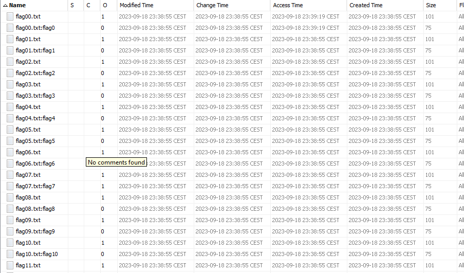

# hide and split

We are provided with a `.ntfs` image, which is a file system format that can be parsed by [Autopsy](https://www.autopsy.com). After looking for a while we can see that the only files inside of the image are numbered txt files:



The `flag{number}.txt` files do not contain anything useful, but the companion files (`flag{number}.txt:flag{number}`) all contain different text:


These companion files use something called alternate data streams (or ADS) for storing data. It cannot be read very easily on windows, so malware will sometimes leverage this to hide data or executables.

Anyway, after extracting all interesting files we can use a small script to concatenate their contents and display it as a single string:

```python
import os

def get_filtered_files(directory='.'):
    return sorted(
        (int(file_name.split('flag')[1][:-5]), file_name)
        for file_name in os.listdir(directory)
        if os.path.isfile(file_name) and not file_name.endswith(('.txt', '.py'))
    )

def read_concatenated_content(files):
    return ''.join(
        open(file_name, 'r').read().strip()
        for _, file_name in files
    )

if __name__ == "__main__":
    filtered_files = get_filtered_files()
    concatenated_content = read_concatenated_content(filtered_files)
    print(concatenated_content)
```

The output looks very much like hex encoded data, that when looking further appeared to create an image of a QR-code. When parsing this QR-code we finally get out flag. [Here](https://gchq.github.io/CyberChef/#recipe=From_Hex('Auto')Render_Image('Raw')Parse_QR_Code(false)&input=ODk1MDRlNDcwZDBhMWEwYTAwMDAwMDBkNDk0ODQ0NTIwMDAwMDMzOTAwMDAwMzM5MDgwMDAwMDAwMDAxNzlhMGM1MDAwMDBlNjg0OTQ0NDE1NDc4ZGFlZGRiY2I2MWU0MzAwYzQ0YzFjOTNmNjk2ZjBjYjNlYTA2MjBiYmRlNTViNjNlMjQ4YWI3ZjlmYzQ4ZmFiZThmMjU5MGM4OTFjODkxYzg5MWM4OTE0NDhlNDQ4ZTQ0OGU0NDhlNDQ4ZTI0NzIyNDcyMjQ3MjI0NzIyNDcyMjQ5MTIzOTEyMzkxMjM5MTIzOTEyMzg5MWM4OTFjODkxYzg5MWM4OTFjNDllNDQ4ZTQ0OGU0NDhlNDQ4ZTQ0ODIyNDcyMjQ3MjI0NzIyNDcyMjQ3MTIzOTEyMzkxMjM5MTIzOTEyMzk5MmM4OTFjODkxYzg5MWM4OTFjODkxNDQ4ZTQ0OGU0NDhlNDQ4ZTQ0OGUyNDcyMjQ3MjI0NzIyNDcyMjQ3MjI0OTEyMzkxMjM5MTIzOTEyMzkxMjM4OTFjODkxYzg5MWM4OTFjODkxYzQ5ZTQ0OGU0NDhlNDQ4ZTQ0OGU0NDgyMjQ3MjI0NzIyNDcyMjQ3MjJlN2ZmZWUzNWQ1NTdjZjBkN2U1MWYwOGZjNzZlMTU3Y2VlOTM3NTdlNzJlN2RlZTQ5MDQzMGUzOWU0OTA0MzBlMzllNDkwNDMwZTM5ZTQ5MDQzMGUzOWU0OTA0MzBlMzllNDkwNDMwZTM5ZTQ5MDQzMGUzOWU0OTA0MzBlMzllNDkwNDMwZTM5ZTQ5MDQzMGUzOWU0OTA0MzBlMzllNDkwMzMyNmU3ZTY5ZDdiMjY5ZjVjM2QyMjM2NzhlNzVmZjAwOWU0OTA0MzBlMzllNDkwNDMwZTM5ZTQ5MDQzMGUzOWU0OTA0MzBlMzllNDkwNDMwZTM5ZTQ5MDQzMGUzOWU0OTA0MzBlMzllNDkwNDMwZTM5ZTQ5MDQzMGUzOWU0OTA0MzBlMzllNDkwNDMwZTM5ZTRmNGRlMzJmODBiOWNiMWFiNGYyMDNkZjlmY2UwZTIwNDc3NjFlYmE0MTg1YjFjNzJjODIxODcxYzcyYzgyMTg3MWM3MmM4MjE4NzFjNzJjODIxODcxYzcyYzgyMTg3MWM3MmM4MjE4NzFjNzJjODIxODcxYzcyYzgyMTg3MWM3MmM4MjE4NzFjNzJjODIxODcxYzcyYzgyMTg3MWM3MjdlODE5Y2RlNWJkZDQ0MThmYzg0ZTBmZjhlMmQyYzM5ZTQ5MDQzMGUzOWU0OTA0MzBlMzllNDkwNDMwZTM5ZTQ5MDQzMGUzOWU0OTA0MzBlMzllNDkwNDMwZTM5ZTQ5MDQzMGUzOWU0OTA0MzBlMzllNDkwNDMwZTM5ZTQ5MDQzMGUzOWU0OTA0MzBlMzllNDVjZDhhNDIwYTQ0ZmFkZGU4MzllMDAyNjg3MWM3MmM4MjE4NzFjNzJjODIxODcxYzcyYzgyMTg3MWM3MmM4MjE4NzFjNzJjODIxODcxYzcyYzgyMTg3MWM3MmM4MjE4NzFjNzJjODIxODcxYzcyYzgyMTg3MWM3MmM4MjE4NzFjNzJjODIxODc5Yzk1M2IzZmQ5ZmUxZWIzZTA1YWY1MDYzYTA4ZTk4ZDkzNDMwZTM5ZTQ5MDQzMGUzOWU0OTA0MzBlMzllNDkwNDMwZTM5ZTQ5MDQzMGUzOWU0OTA0MzBlMzllNDkwNDMwZTM5ZTQ5MDQzMGUzOWU0OTA0MzBlMzllNDkwNDMwZTM5ZTQ5MDQzMGUzOWU0OTA0MzRlZWYyZGI3N2U4MmUyZWFkYmFmYmU0MzNiMzlhZTkyNDM4ZWFiZTQ5MDQzMGUzOWU0OTBlMzJhMzllNGI4NGEwZTM5YWU5MjQzOGVhYmU0OTA0MzBlMzllNDkwZTMyYTM5ZTRiODRhMGUzOWFlOTI0MzhlYWJlNDkwNDMwZTM5ZTQ5MGUzMmEzOTI3YmIzOTBkNWYwZDQ3ZjA4NDFhM2JkZDllYWNjNjZmOTgzYTcyYzgyMTg3MWM3MmM4MjE4NzFjNzJjODIxODcxYzcyYzgyMTg3MWM3MmM4MjE4NzFjNzJjODIxODcxYzcyYzgyMTg3MWM3MmM4MjE4NzFjNzJjODIxODcxYzcyYzgyMTg3MWM3MmM4MjE4NzFjNzI5NjMwMDRlN2VjYzk4M2M2YTY3ZjZiYTA3YjdmN2NmM2VjMjM4NzFjNzJjODIxODcxYzcyYzgyMTg3MWM3MmM4MjE4NzFjNzJjODIxODcxYzcyYzgyMTg3MWM3MmM4MjE4NzFjNzJjODIxODcxYzcyYzgyMTg3MWM3MmM4MjE4NzFjNzJjODIxODcxYzcyYzgyMTY3NGNjZTkzZmQwZWJhMGFmZWYxOTM0ZmQ4MDIxY2ZjZGUyM2Y4ODM4MzQ0MGUzOWU0OTA0MzBlMzllNDkwNDMwZTM5ZTQ5MDQzMGUzOWU0OTA0MzBlMzllNDkwNDMwZTM5ZTQ5MDQzMGUzOWU0OTA0MzBlMzllNDkwNDMwZTM5ZTQ5MDQzMGUzOWU0OTA0MzBlMzllNDkwNDM0ZTRmY2VkNjQyZjdkNmFlZjdhMGIxYzFiYWE5NmVlYzc0MjM4NzFjNzJjODIxODcxYzcyYzgyMTg3MWM3MmM4MjE4NzFjNzJjODIxODcxYzcyYzgyMTg3MWM3MmM4MjE4NzFjNzJjODIxODcxYzcyYzgyMTg3MWM3MmM4MjE4NzFjNzJjODIxODcxYzcyYzgyMWU3MTU3MjhlYWM1ZGYwN2ZiNzIwMDU0N2U3ZTY3MTE2OWMxYzcyYzgyMTg3MWM3MmM4MjE4NzFjNzJjODIxODcxYzcyYzgyMTg3MWM3MmM4MjE4NzFjNzJjODIxODcxYzcyYzgyMTg3MWM3MmM4MjE4NzFjNzJjODIxODcxYzcyYzgyMTg3MWM3MmM4MjE4NzFjNzJiNmU0ZjQwNjNhNDhiNGI3NjdjMWZmMWQzYjkyODJhNzRjNmY5ZGM3OGUzMzcyYzgyMTg3MWM3MmM4MjE4NzFjNzJjODIxODcxYzcyYzgyMTg3MWM3MmM4MjE4NzFjNzJjODIxODcxYzcyYzgyMTg3MWM3MmM4MjE4NzFjNzJjODIxODcxYzcyYzgyMTg3MWM3MmM4MjE4NzFjNzI3YTkwNWVjMTJjYjhlZWMxZTc3ZTcyMDUzZjdmNmM3ZjdiODcwZTM5ZTQ5MDQzMGUzOWU0OTA0MzBlMzllNDkwNDMwZTM5ZTQ5MDQzMGUzOWU0OTA0MzBlMzllNDkwNDMwZTM5ZTQ5MDQzMGUzOWU0OTA0MzBlMzllNDkwNDMwZTM5ZTQ5MDQzMGUzOWU0OTA0MzBlMzk1YjcyYmU1YWU4OWI4YjM1ODYzZjc4YjU4NzdmNmM3MTgyNjM0NjBlMzllNDkwNDMwZTM5ZTQ5MDQzMGUzOWU0OTA0MzBlMzllNDkwNDMwZTM5ZTQ5MDQzMGUzOWU0OTA0MzBlMzllNDkwNDMwZTM5ZTQ5MDQzMGUzOWU0OTA0MzBlMzllNDkwNDMwZTM5ZTQ5MDQzY2U5ODljZTA0MmY3NzYyNWY4YmYzZDBjNWI0YmQ3YjNkMTNiNjViNjhlNTE3MmM4MjE4NzFjNzJjODIxODcxYzcyYzgyMTg3MWM3MmM4MjE4NzFjNzJjODIxODcxYzcyYzgyMTg3MWM3MmM4MjE4NzFjNzJjODIxODcxYzcyYzgyMTg3MWM3MmM4MjE4NzFjNzJjODIxODcxYzcyODJiYjcyNzNkYzdiOWIxNDljOTVkZWY5MzU4NjdmMGNmMDRmMmQ3MmM4MjE4NzFjNzJjODIxODcxYzcyYzgyMTg3MWM3MmM4MjE4NzFjNzJjODIxODcxYzcyYzgyMTg3MWM3MmM4MjE4NzFjNzJjODIxODcxYzcyYzgyMTg3MWM3MmM4MjE4NzFjNzJjODIxODcxYzcyNmU0MjFhOWJhNDU3OGNkZGQ4ZTI2YzFkNzY2M2U3MjYzOWU0OTA0MzBlMzllNDkwNDMwZTM5ZTQ5MDQzMGUzOWU0OTA0MzBlMzllNDkwNDMwZTM5ZTQ5MDQzMGUzOWU0OTA0MzBlMzllNDkwNDMwZTM5ZTQ5MDQzMGUzOWU0OTA0MzBlMzllNDkwNDMwZTM5NjNhMzMzYjYwZGMxODE3ZWYyYTA1NzNjZjdlNmMyNmUxZDBkZTQ5MDQzMGUzOWU0OTA0MzBlMzllNDkwNDMwZTM5ZTQ5MDQzMGUzOWU0OTA0MzBlMzllNDkwNDMwZTM5ZTQ5MDQzMGUzOWU0OTA0MzBlMzllNDkwNDMwZTM5ZTQ5MDQzMGUzOWU0OTA0MzBlMzllNGY0YTgwNDM3Mjk3OGU3NGZhZGRlYjE3MjY0YmU3YjViZDZkYjIzNzJjODIxODcxYzcyYzgyMTg3MWM3MmM4MjE4NzFjNzJjODIxODcxYzcyYzgyMTg3MWM3MmM4MjE4NzFjNzJjODIxODcxYzcyYzgyMTg3MWM3MmM4MjE4NzFjNzJjODIxODcxYzcyYzgyMTg3MWM3MmM2ZTRmNGM2M2Q2ODYzNmIwYjZmOGFlZDdkYzJkNmY0OTM0MzBlMzllNDkwNDMwZTM5ZTQ5MDQzMGUzOWU0OTA0MzBlMzllNDkwNDMwZTM5ZTQ5MDQzMGUzOWU0OTA0MzBlMzllNDkwNDMwZTM5ZTQ5MDQzMGUzOWU0OTA0MzBlMzllNDkwNDMwZTM5ZTQ5MGYzMGEzOWMxZDVmOWNhYzZkODZiZjRkZTM5NzgxNmY0NGU5OTU3ZWMyZjM5ZTQ5MDQzMGUzOWU0OTA0MzBlMzllNDkwNDMwZTM5ZTQ5MDQzMGUzOWU0OTA0MzBlMzllNDkwNDMwZTM5ZTQ5MDQzMGUzOWU0OTA0MzBlMzllNDkwNDMwZTM5ZTQ5MDQzMGUzOWU0OTA0MzBlMzkzN2U1ZjRhZTE2MTdlYmMxODM4ZTRjNzA4ZmQ5OThkOGFkZGQyNzg3MWM3MmM4MjE4NzFjNzJjODIxODcxYzcyYzgyMTg3MWM3MmM4MjE4NzFjNzJjODIxODcxYzcyYzgyMTg3MWM3MmM4MjE4NzFjNzJjODIxODcxYzcyYzgyMTg3MWM3MmM4MjE4NzFjNzJjODIxNjc2YmIwODJjZmRkODJkNDdiYWIzNzJlZWNkNjZiMTQ3NzlmMWM3MmM4MjE4NzFjNzJjODIxODcxYzcyYzgyMTg3MWM3MmM4MjE4NzFjNzJjODIxODcxYzcyYzgyMTg3MWM3MmM4MjE4NzFjNzJjODIxODcxYzcyYzgyMTg3MWM3MmM4MjE4NzFjNzJjODIxODc5YzkzNjMxNzVjOWRiMTRkMWFmYmRlZTA5ZGI3NWVhMzM3ZmRlNDkwNDMwZTM5ZTQ5MDQzMGUzOWU0OTA0MzBlMzllNDkwNDMwZTM5ZTQ5MDQzMGUzOWU0OTA0MzBlMzllNDkwNDMwZTM5ZTQ5MDQzMGUzOWU0OTA0MzBlMzllNDkwNDMwZTM5ZTQ5MDQzMGUzOWU0ZjRlNDA0OTczMmY4YTBhZmZlZjczM2Q1OThkOGRlZjcwNmY3NzdjYzI0MzllNDkwNDMwZTM5ZTQ5MDQzMGUzOWU0OTA0MzBlMzllNDkwNDMwZTM5ZTQ5MDQzMGUzOWU0OTA0MzBlMzllNDkwNDMwZTM5ZTQ5MDQzMGUzOWU0OTA0MzBlMzllNDkwNDMwZTM5ZTQ5MDQzMGUzOTYzNzI4MjIzZGJhMzMyYTZlZWM4MjQ2ZGVkNmY2ZjQzOGY0NDBlMzllNDkwNDMwZTM5ZTQ5MDQzMGUzOWU0OTA0MzBlMzllNDkwNDMwZTM5ZTQ5MDQzMGUzOWU0OTA0MzBlMzllNDkwNDMwZTM5ZTQ5MDQzMGUzOWU0OTA0MzBlMzllNDkwNDMwZTM5ZTQ5MDQzNGU3MDI5Yzc3ZTkxNzI1M2NlOTEyZmVhMjFlYzJkZmJkNjZhOTA0MzBlMzllNDkwNDMwZTM5ZTQ5MDQzMGUzOWU0OTA0MzBlMzllNDkwNDMwZTM5ZTQ5MDQzMGUzOWU0OTA0MzBlMzllNDkwNDMwZTM5ZTQ5MDQzMGUzOWU0OTA0MzBlMzllNDkwNDMwZTM5ZTQ5MGQzNWJmN2RlNzIwNGZmNzg4YmY3Y2QwOWRlMzI3OWY0MTNjODIxODcxYzcyYzgyMTg3MWM3MmM4MjE4NzFjNzJjODIxODcxYzcyYzgyMTg3MWM3MmM4MjE4NzFjNzJjODIxODcxYzcyYzgyMTg3MWM3MmM4MjE4NzFjNzJjODIxODcxYzcyYzgyMTg3MWM3MmM4YTlhZDRlNmY2NTdiODA3YjAzMWQzYzM4YjY4ZTg2MjNkM2RmN2IxMDM5ZTQ5MDQzMGUzOWU0OTA0MzBlMzllNDkwNDMwZTM5ZTQ5MDQzMGUzOWU0OTA0MzBlMzllNDkwNDMwZTM5ZTQ5MDQzMGUzOWU0OTA0MzBlMzllNDkwNDMwZTM5ZTQ5MDQzMGUzOWU0OTA0MzBlMzljMTZmZThkNWRiYzIxZWE0MjM0MzE5NWNmNmFkYjM4ZjFjNzJjODIxODcxYzcyYzgyMTg3MWM3MmM4MjE4NzFjNzJjODIxODcxYzcyYzgyMTg3MWM3MmM4MjE4NzFjNzJjODIxODcxYzcyYzgyMTg3MWM3MmM4MjE4NzFjNzJjODIxODcxYzcyYzgyMTg3OWMyMzcyYmVmYTg2ZTAwNDA3ZGY2YThiNGFmMDdiOGYxYzc2NWJkYWM5MjE4NzFjNzJjODIxODcxYzcyYzgyMTg3MWM3MmM4MjE4NzFjNzJjODIxODcxYzcyYzgyMTg3MWM3MmM4MjE4NzFjNzJjODIxODcxYzcyYzgyMTg3MWM3MmM4MjE4NzFjNzJjODIxODcxYzcyYzhiOTI5ZTdjOWFmMmNjNmY2ZWM4ZDA3Yzc5MWExZGM1YWQ4YWQ3Mzg0MWM3MmM4MjE4NzFjNzJjODIxODcxYzcyYzgyMTg3MWM3MmM4MjE4NzFjNzJjODIxODcxYzcyYzgyMTg3MWM3MmM4MjE4NzFjNzJjODIxODcxYzcyYzgyMTg3MWM3MmM4MjE4NzFjNzJjODIxODc5Y2RmMzczYTViODNkNTNiNjU5ZWNjZDlkODcxMzZmNmJkZTQ5MDQzMGUzOWU0OTA0MzBlMzllNDkwNDMwZTM5ZTQ5MDQzMGUzOWU0OTA0MzBlMzllNDkwNDMwZTM5ZTQ5MDQzMGUzOWU0OTA0MzBlMzllNDkwNDMwZTM5ZTQ5MDQzMGUzOWU0OTA0MzBlMzllNDFjOTE3MzQ0ZGQxMzFiYzEwZGRlOWFlZjM3ZWVlMGQ4YjE0MjBlMzllNDkwNDMwZTM5ZTQ5MDQzMGUzOWU0OTA0MzBlMzllNDkwNDMwZTM5ZTQ5MDQzMGUzOWU0OTA0MzBlMzllNDkwNDMwZTM5ZTQ5MDQzMGUzOWU0OTA0MzBlMzllNDkwNDMwZTM5ZTQ5MDQzY2U5NjljZGU3YzhmZWRkOWQ4MTc4ZDg5N2QzMjY3NjM5ZjdmNjRhZWM4MjE4NzFjNzJjODIxODcxYzcyYzgyMTg3MWM3MmM4MjE4NzFjNzJjODIxODcxYzcyYzgyMTg3MWM3MmM4MjE4NzFjNzJjODIxODcxYzcyYzgyMTg3MWM3MmM4MjE4NzFjNzJjODIxODcxYzcyYzgwOTUyNzlmMmZkYzEzYjNmYjlkNWQ4NmI2YzRkYzNkODJlZjRiZWI3Njc4MzFjNzJjODIxODcxYzcyYzgyMTg3MWM3MmM4MjE4NzFjNzJjODIxODcxYzcyYzgyMTg3MWM3MmM4MjE4NzFjNzJjODIxODcxYzcyYzgyMTg3MWM3MmM4MjE4NzFjNzJjODIxODcxYzcyYzgyMTg3OWMzNzE2OWNiMzI3ZTMxZTljZDFiMTcxM2Y3MjhlNmNmMTI2ODcxYzcyYzgyMTg3MWM3MmM4MjE4NzFjNzJjODIxODcxYzcyYzgyMTg3MWM3MmM4MjE4NzFjNzJjODIxODcxYzcyYzgyMTg3MWM3MmM4MjE4NzFjNzJjODIxODcxYzcyYzgyMTg3MWM3MmM4MjFhNzI3ZTczM2Q1Y2RiNzFhZmJjZGM5ZDg0YTA2Y2Y5MWIxYWJlNDkwNDMwZTM5ZTQ5MDQzMGUzOWU0OTA0MzBlMzllNDkwNDMwZTM5ZTQ5MDQzMGUzOWU0OTA0MzBlMzllNDkwNDMwZTM5ZTQ5MDQzMGUzOWU0OTA0MzBlMzllNDkwNDMwZTM5ZTQ5MDQzMGUzOWU0ZGM5NDMzNzZlNzMxNTdjMWNmZWZiZGYzZDZhNjFjMzlmYjdlYTYyMjg3MWM3MmM4MjE4NzFjNzJjODIxODcxYzcyYzgyMTg3MWM3MmM4MjE4NzFjNzJjODIxODcxYzcyYzgyMTg3MWM3MmM4MjE4NzFjNzJjODIxODcxYzcyYzgyMTg3MWM3MmM4MjE4NzFjNzJjODIxMjczOGRmYmRlZDFmN2I4ZGRlYWY0YTdhMmZiOWE1YWVmN2JkNGZmNjg4MWM3MmM4MjE4NzFjNzJjODIxODcxYzcyYzgyMTg3MWM3MmM4MjE4NzFjNzJjODIxODcxYzcyYzgyMTg3MWM3MmM4MjE4NzFjNzJjODIxODcxYzcyYzgyMTg3MWM3MmM4MjE4NzFjNzJjODIxODcxYzcyNTIzNjhlM2M3N2VjMTM3YWFlN2FjY2M4MjE4NzFjNzJjODIxODcxYzcyYzgyMTg3MWM3MmM4MjE4NzFjNzJjODIxODcxYzcyYzgyMTg3MWM3MmM4MjE4NzFjNzJjODIxODcxYzcyYzgyMTg3MWM3MmM4MjE4NzFjNzJjODIxODcxYzcyYzhmOWUzNzI4MmQzMzA4NjIxYjg3NDYzZGYxYjdjNTBlZmYzYzkyMTg3MWM3MmM4MjE4NzFjNzJjODIxODcxYzcyYzgyMTg3MWM3MmM4MjE4NzFjNzJjODIxODcxYzcyYzgyMTg3MWM3MmM4MjE4NzFjNzJjODIxODcxYzcyYzgyMTg3MWM3MmM4MjE4NzFjNzJjOGI5MjllN2M4OWRiN2M0OGU2ZGZmZDY0OWYxZTQyY2U4MWQ0OWJkYzgyMTg3MWM3MmM4MjE4NzFjNzJjODIxODcxYzcyYzgyMTg3MWM3MmM4MjE4NzFjNzJjODIxODcxYzcyYzgyMTg3MWM3MmM4MjE4NzFjNzJjODIxODcxYzcyYzgyMTg3MWM3MmM4MjE4NzFjNzJjOGQ5OWE5NWIxZDFiOWM5NmNlYzBjMGFiZWM2ZDZmNDhmNDEyMjg3MWM3MmM4MjE4NzFjNzJjODIxODcxYzcyYzgyMTg3MWM3MmM4MjE4NzFjNzJjODIxODcxYzcyYzgyMTg3MWM3MmM4MjE4NzFjNzJjODIxODcxYzcyYzgyMTg3MWM3MmM4MjE4NzFjNzJjODIxNDcxMjM5MTIzOTEyMzkxMjM5MTIzOTkyYzg5MWM4OTFjODkxYzg5MWM4OTE0NDhlNDQ4ZTQ0OGU0NDhlNDQ4ZTI0NzIyNDcyMjQ3MjI0NzIyNDcyMjQ5MTIzOTEyMzkxMjM5MTIzOTEyMzg5MWM4OTFjODkxYzg5MWM4OTFjNDllNDQ4ZTQ0OGU0NDhlNDQ4ZTQ0ODIyNDcyMjQ3MjI0NzIyNDcyMjQ3MTIzOTEyMzkxMjM5MTIzOTEyMzk5MmM4OTFjODkxYzg5MWM4OTFjODkxNDQ4ZTQ0OGU0NDhlNDQ4ZTQ0OGUyNDcyMjQ3MjI0NzIyNDcyMjQ3MjI0OTEyMzkxMjM5MTIzOTEyMzkxMjM4OTFjODkxYzg5MWM4OTFjO) is the final solution with CyberChef.


Flag: `TCP1P{hidden_flag_in_the_extended_attributes_fea73c5920aa8f1c}`