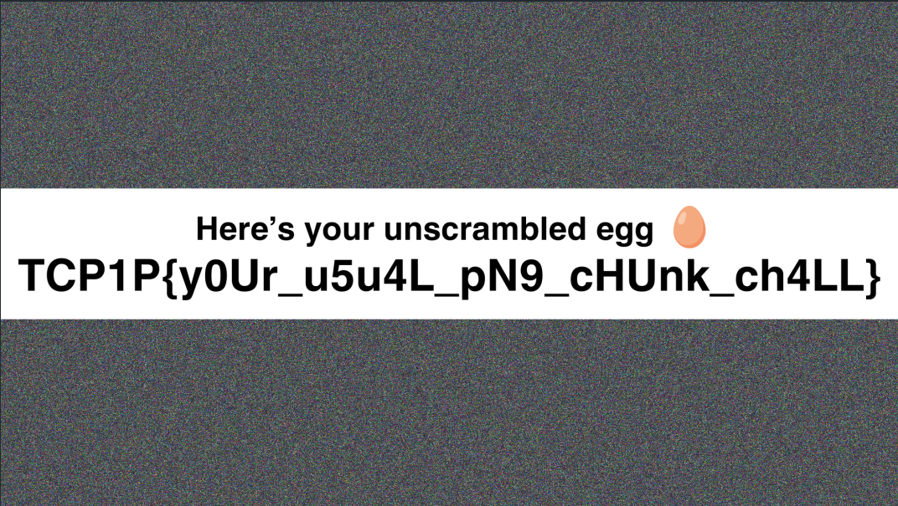

# scrambled egg

The [`scramble.py`](http://scramble.py) file describes how the original image was modified before becoming `scrambled.png`. Basically we want to reverse the steps taken by `scramble.py` and create an inverse function that takes in `scrambled.png` to generate the original image.

The logic was somewhat complex, so I started with a simpler 1x1 image I found online and worked from there. The interesting part is that [`scramble.py`](http://scramble.py) is actually lossy, generating an output image that is smaller than the input image. The missing bytes are chunk checksums though, and we can retrieve these by re-generating them ourselves as the chunk data is known.

```python
from struct import pack, unpack
import zlib

PNG_SIGNATURE = b"\x89PNG\r\n\x1a\n"
PNG_SIGNATURE_HEX = "0a1a0a0d"
CHUNK_SIZE_OFFSET = 4
CHUNK_TYPE_OFFSET = 4
CRC_SIZE = 4

def to_int(byte_seq):
    return unpack(">I", byte_seq)[0]

def unscramble_chunk(chunk):
    size_field = chunk[-CHUNK_SIZE_OFFSET:][::-1]
    type_field = chunk[-(CHUNK_SIZE_OFFSET + CHUNK_TYPE_OFFSET) : -CHUNK_SIZE_OFFSET]
    data_field = chunk[: -(CHUNK_SIZE_OFFSET + CHUNK_TYPE_OFFSET)]
    crc32 = pack(">I", zlib.crc32(type_field + data_field))
    return size_field + type_field + data_field + crc32

def process_chunk(byte_data, offset):
    if offset:
        chunk_size_bytes = byte_data[-offset - CHUNK_SIZE_OFFSET : -offset][::-1]
    else:
        chunk_size_bytes = byte_data[-offset - CHUNK_SIZE_OFFSET :][::-1]

    if chunk_size_bytes.hex() == PNG_SIGNATURE_HEX:
        return PNG_SIGNATURE, 0

    chunk_size_int = to_int(chunk_size_bytes)
    return (
        unscramble_chunk(
            byte_data[-offset - chunk_size_int - CHUNK_TYPE_OFFSET - CRC_SIZE : -offset]
        ),
        chunk_size_int,
    )

def reverse_chunks(chunks):
    reversed_chunks = []
    for _ in range(len(chunks)):
        reversed_chunks.append(chunks[0])
        chunks = chunks[1:][::-1]
    return reversed_chunks[::-1]

def process_file(file_path):
    byte_data = open(file_path, "rb").read()
    new_chunks = []
    offset = 0
    total_length = len(byte_data)

    while offset < total_length:
        chunk, chunk_size = process_chunk(byte_data, offset)
        new_chunks.append(chunk)
        offset += chunk_size + CHUNK_TYPE_OFFSET + CRC_SIZE

    return reverse_chunks(new_chunks[::-1])

def main():
    input_file = "scrambled.png"
    output_file = "unscrambled.png"

    final_chunks = process_file(input_file)

    with open(output_file, "wb") as f:
        f.write(b"".join(final_chunks))

if __name__ == "__main__":
    main()
```



Flag: `TCP1P{y0Ur_u5u4L_pN9_cHUnk_ch4LL}`