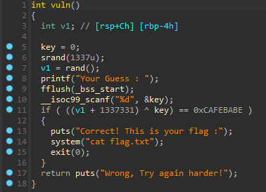

# Guess My Number

We start with a 64-bit elf binary `guess`:

```python
❯ file guess
guess: ELF 64-bit LSB pie executable, x86-64, version 1 (SYSV), dynamically linked, interpreter /lib64/ld-linux-x86-64.so.2, BuildID[sha1]=4387911100f9b1f1805aab9e25a7b4858e277486, for GNU/Linux 3.2.0, not stripped
```

Decompiling the binary in IDA reveals that the vulnerable code contains the hard coded seed $1337$



We can then calculate the first value from the random function using the same function in c

```python
int main()
{
    srand(1337);
    int r = rand() + 1337331;
    printf("%d", val);
    return 0;
}
```

Output: $293954012$

The final step is to find a numeric key, such that $3682327394 \bigoplus key = 0xCAFEBABE$:

```python
# Given values
A = 293954012
C = 0xCAFEBABE

# Calculating the key using XOR operation
key = A ^ C
```

Output: $3682327394$

Connecting to the server and entering this value finally gives us the flag.

Flag: `TCP1P{r4nd0m_1s_n0t_th4t_r4nd0m_r19ht?_946f38f6ee18476e7a0bff1c1ed4b23b}`